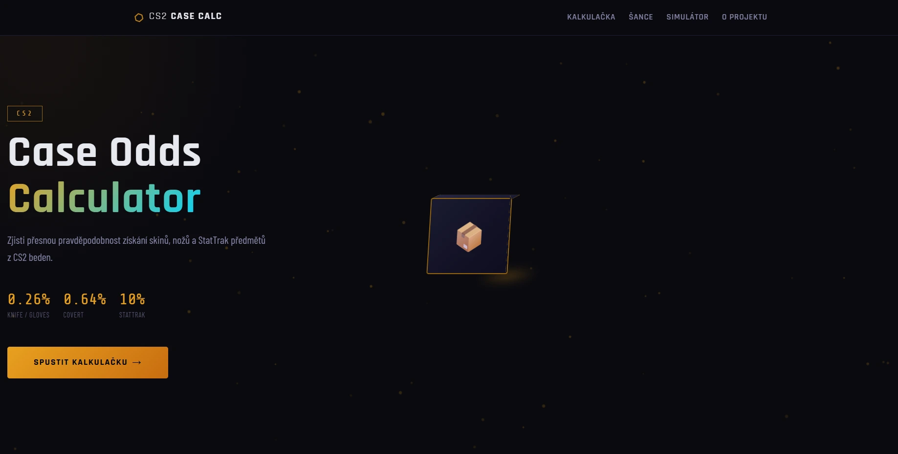
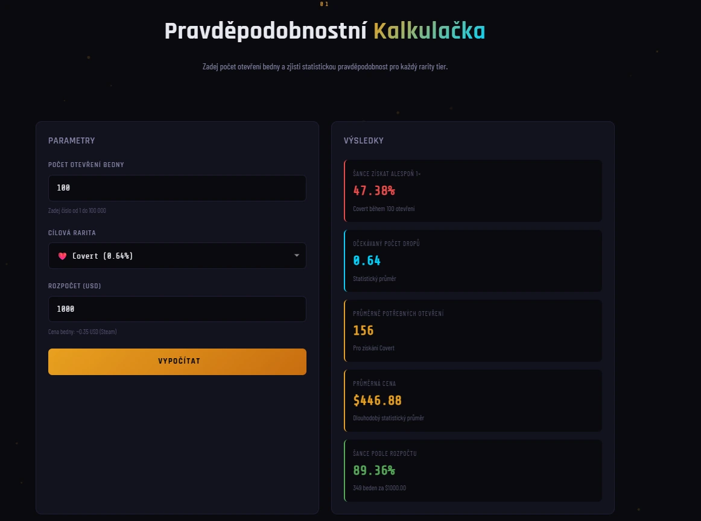
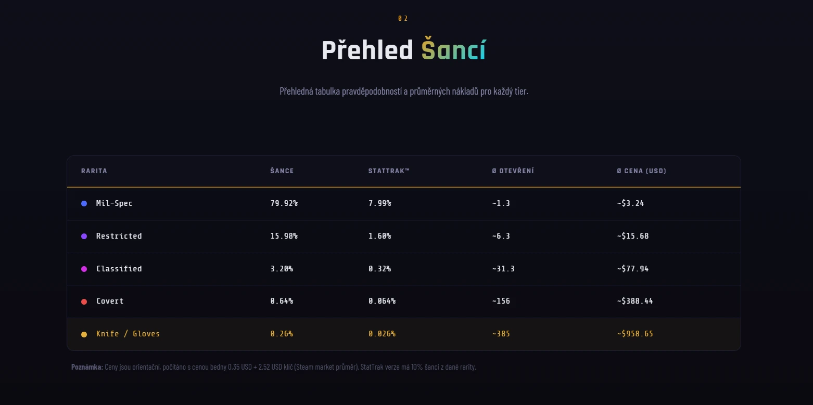
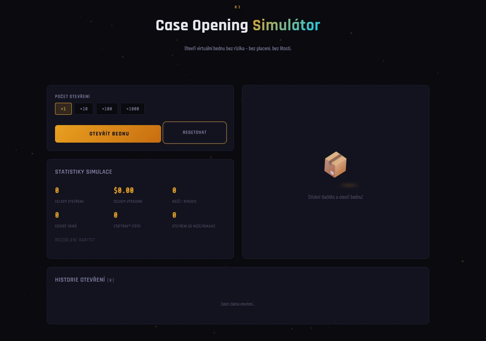
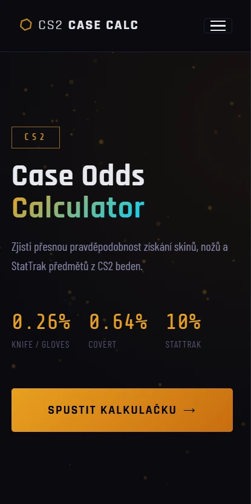
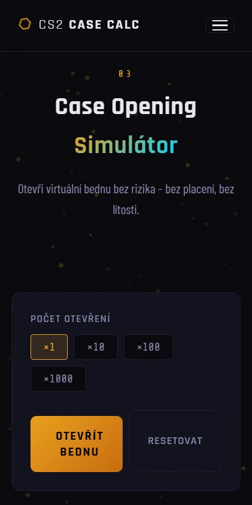
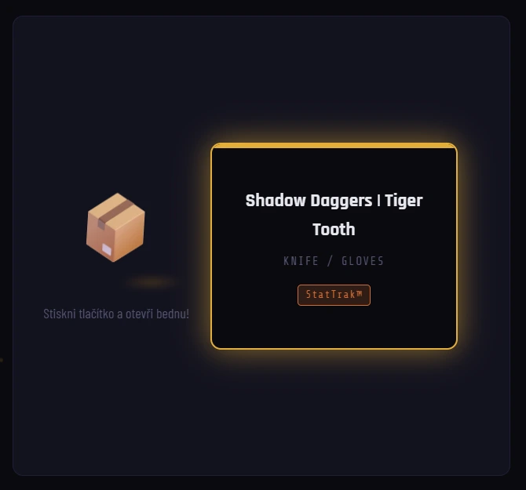
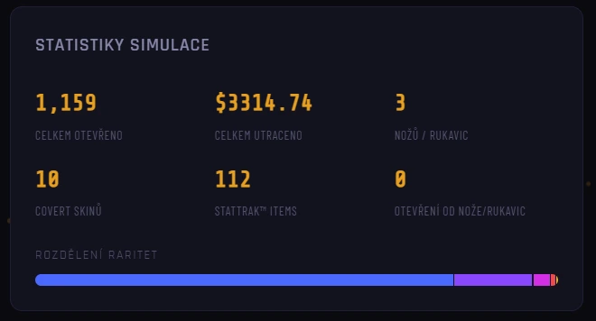

# CS2 Case Odds Calculator

> Webová aplikace pro výpočet a simulaci pravděpodobností získání skinů z Counter-Strike 2 beden.

🔗 **Živý web:** [https://rudisss09.github.io/web_projekt_okurka/](https://rudisss09.github.io/web_projekt_okurka/)

---

## 1. Úvod

**CS2 Case Odds Calculator** je interaktivní webová aplikace, která uživatelům umožňuje vypočítat a vizualizovat pravděpodobnosti získání skinů z beden v Counter-Strike 2. Projekt zahrnuje pravděpodobnostní kalkulačku, přehlednou tabulku šancí pro jednotlivé rarity tiery a plně funkční simulátor otevírání beden s historií a statistikami.

Pravděpodobnosti vychází z oficálně zveřejněných dat Valve Corporation (Container Odds), která jsou ze zákona povinně dostupná hráčům v EU.

Projekt byl vytvořen jako ročníková práce z předmětu **Webové technologie (2026)** na střední škole, bez použití jakýchkoli frameworků – čistě v HTML5, CSS3 a Vanilla JavaScript.

---

## 2. Použité technologie

| Technologie | Verze / Specifikace |
|---|---|
| HTML | HTML5 (sémantické značky, ARIA, structured data) |
| CSS | CSS3 (Flexbox, Grid, Custom Properties, animace) |
| JavaScript | Vanilla JS / ES6+ (bez frameworků) |
| Canvas API | Nativní prohlížečové API – animované pozadí |
| Intersection Observer API | Nativní prohlížečové API – scroll animace |
| Fonty | Google Fonts (Rajdhani, Share Tech Mono, Barlow Condensed) |
| SEO | Meta tagy, Open Graph, Twitter Cards, JSON-LD Schema.org |
| Přístupnost | WCAG 2.1 AA, ARIA atributy, klávesnicová navigace |
| IDE | Visual Studio Code |
| Hosting | GitHub Pages |

---

## 3. Adresářová struktura

```
web_projekt_okurka/
├── index.html        # Hlavní a jediná HTML stránka (SPA struktura)
├── style.css         # Veškeré styly – layout, komponenty, animace, responzivita
├── js.js             # Veškerá logika – kalkulačka, simulátor, Canvas, animace
├── robots.txt        # Direktiva pro web crawlery (SEO)
├── sitemap.xml       # Mapa webu pro vyhledávače (SEO)
└── README.md         # Dokumentace projektu
```

> Projekt je záměrně tvořen jako **single-page aplikace** – veškerý obsah je na jedné stránce rozdělené do sekcí, mezi nimiž se plynule scrolluje.

---

## 4. Technický rozbor

Projekt pokrývá 6 klíčových oblastí webové optimalizace:

---

### 4.1 Sémantické HTML a přístupnost (WCAG / ARIA)

**Teoretický popis:**
Sémantické HTML5 elementy (`<header>`, `<main>`, `<section>`, `<footer>`, `<nav>`) poskytují strukturu dokumentu srozumitelnou jak lidem, tak strojům (vyhledávače, screen readery). ARIA (Accessible Rich Internet Applications) atributy doplňují tam, kde nativní HTML nestačí – zejména u dynamického obsahu a interaktivních widgetů. Cílem je soulad s normou WCAG 2.1 na úrovni AA.

**Code snippet:**
```html
<!-- Skip link pro klávesnicové uživatele a screen readery -->
<a href="#main-content" class="skip-link">Přeskočit na hlavní obsah</a>

<!-- Hamburger tlačítko s ARIA stavem -->
<button class="nav-toggle"
  aria-label="Otevřít menu"
  aria-expanded="false"
  aria-controls="mobile-menu">
  <span class="hamburger" aria-hidden="true"></span>
</button>

<!-- Mobilní menu jako dialog s rolí a modálností -->
<div id="mobile-menu" class="mobile-menu"
  role="dialog"
  aria-label="Mobilní navigace"
  aria-modal="true"
  hidden>
```

Atribut `aria-expanded` se dynamicky přepíná v JavaScriptu podle stavu menu. Atribut `aria-hidden="true"` skrývá dekorativní prvky (ikony, Canvas) před screen readery. Živé regiony (`aria-live="polite"` a `aria-live="assertive"`) zajišťují, že screen reader oznamuje výsledky simulace bez nutnosti přesunout fokus.

---

### 4.2 CSS architektura – Custom Properties, Flexbox, Grid

**Teoretický popis:**
Projekt nevyužívá žádný CSS framework – veškerý design je postaven na nativních CSS Custom Properties (proměnných), které centralizují design tokens (barvy, mezery, font-stack, přechody). Layout je řešen kombinací CSS Flexbox (jednorozměrné rozmístění) a CSS Grid (dvourozměrné mřížky pro sekce kalkulačky a simulátoru).

**Code snippet:**
```css
/* Design tokens v :root – jeden zdroj pravdy pro celý design systém */
:root {
  --bg-primary: #0a0a0f;
  --accent: #e8a020;
  --cyan: #00d4ff;

  /* Rarity Colors – odpovídají CS2 herním barvám */
  --milspec:    #4b69ff;
  --restricted: #8847ff;
  --classified: #d32ee6;
  --covert:     #eb4b4b;
  --knife:      #e4ae39;

  --font-display: 'Rajdhani', 'Arial Narrow', sans-serif;
  --gap-md: 16px;
  --transition: 0.25s ease;
}

/* Gradient text efekt pomocí background-clip */
.gradient-text {
  background: linear-gradient(135deg, var(--accent) 0%, var(--cyan) 100%);
  -webkit-background-clip: text;
  -webkit-text-fill-color: transparent;
  background-clip: text;
}
```

Díky Custom Properties stačí změnit hodnotu na jednom místě a efekt se projeví v celém projektu. Rarity barvy jsou přesně přizpůsobeny vizuálnímu stylu CS2.

---

### 4.3 Responzivní design (Mobile-first)

**Teoretický popis:**
Web je navržen přístupen mobile-first – základní styly platí pro nejmenší obrazovky a pomocí `min-width` media queries se layout rozšiřuje pro tablety a desktopy. Klíčové breakpointy jsou 768 px (tablet) a 1024 px (desktop). Navigace se na mobilech mění na hamburger menu s plynulou animací.

**Code snippet:**
```css
/* Mobilní výchozí stav – nav-links skryty */
.nav-links {
  display: none;
  list-style: none;
  gap: var(--gap-lg);
}

/* Desktop – nav-links zobrazeny jako flex řádek */
@media (min-width: 768px) {
  .nav-links { display: flex; }
  .nav-toggle { display: none; }
  .container { padding: 0 var(--gap-lg); }
}

/* Odpověď na uživatelovu preferenci – zákaz animací */
@media (prefers-reduced-motion: reduce) {
  *, *::before, *::after {
    animation-duration: 0.01ms !important;
    transition-duration: 0.01ms !important;
  }
  html { scroll-behavior: auto; }
}
```

Media query `prefers-reduced-motion` je důležitou součástí přístupnosti – uživatelé s vestibulárními poruchami nebo epilepsií mohou mít v OS nastavené omezení pohybu, které web respektuje.

---

### 4.4 SEO – Meta tagy, Open Graph, JSON-LD

**Teoretický popis:**
SEO (Search Engine Optimization) zahrnuje technická opatření, která pomáhají vyhledávačům obsah najít, porozumět mu a správně ho zobrazit. Projekt implementuje základní meta tagy, Open Graph protokol (pro sdílení na sociálních sítích), Twitter Cards a strukturovaná data ve formátu JSON-LD (Schema.org), která Googlu umožňují zobrazit rich snippets.

**Code snippet:**
```html
<!-- Základní SEO -->
<meta name="description" content="CS2 Case Opening Odds Calculator – zjisti pravděpodobnost získání skinů z CS2 beden." />
<meta name="robots" content="index, follow" />
<link rel="canonical" href="https://rudisss09.github.io/web_projekt_okurka/" />

<!-- Open Graph – náhledová karta při sdílení -->
<meta property="og:type" content="website" />
<meta property="og:title" content="CS2 Case Odds Calculator" />
<meta property="og:image" content="https://rudisss09.github.io/cs2-case-calculator/images/og-image.png" />
<meta property="og:url" content="https://rudisss09.github.io/web_projekt_okurka/" />

<!-- Strukturovaná data JSON-LD pro Google rich results -->
<script type="application/ld+json">
{
  "@context": "https://schema.org",
  "@type": "WebApplication",
  "name": "CS2 Case Odds Calculator",
  "applicationCategory": "GameApplication",
  "operatingSystem": "Web",
  "url": "https://rudisss09.github.io/web_projekt_okurka/",
  "inLanguage": "cs"
}
</script>
```

Soubory `robots.txt` a `sitemap.xml` v kořenovém adresáři doplňují SEO infrastrukturu – robots.txt říká crawlerům co indexovat, sitemap.xml jim poskytuje mapu všech URL.

---

### 4.5 Animace a Canvas API

**Teoretický popis:**
Animované pozadí je vykreslováno pomocí HTML5 Canvas API v reálném čase – jde o techniku particle systému, kde se na plátně pohybují stovky drobných částic, které simulují atmosféru herního rozhraní CS2. Sekce webu se při scrollování zobrazují plynulou animací díky Intersection Observer API, které je výkonnostně výrazně lepší než sledování `scroll` eventu.

**Code snippet:**
```html
<!-- Canvas je dekorativní – screen readery ho ignorují -->
<canvas id="bg-canvas" aria-hidden="true"></canvas>
```

```css
/* Canvas jako fixované pozadí přes celý viewport */
#bg-canvas {
  position: fixed;
  top: 0; left: 0;
  width: 100%; height: 100%;
  pointer-events: none;
  z-index: 0;
  opacity: 0.4;
}

/* Stav před zobrazením sekce (Intersection Observer) */
.fade-in-section {
  opacity: 0;
  transform: translateY(24px);
  transition: opacity 0.6s ease, transform 0.6s ease;
}

/* Třída přidaná JavaScriptem po vstupu do viewport */
.fade-in-section.visible {
  opacity: 1;
  transform: translateY(0);
}
```

Glow efekty na výsledcích simulace jsou řešeny čistým CSS pomocí `box-shadow` – třída se dynamicky přiřadí podle rarity získaného skinu, čímž výsledek vizuálně odpovídá herní paletě barev CS2.

---

### 4.6 Interaktivní JavaScript – Kalkulačka a Simulátor

**Teoretický popis:**
Pravděpodobnostní kalkulačka počítá šanci alespoň jednoho úspěchu za `n` otevření pomocí vzorce doplňkové pravděpodobnosti: `P = 1 - (1 - p)^n`. Simulátor generuje pseudonáhodné výsledky pomocí `Math.random()` a váhovaných pravděpodobnostních intervalů odpovídajících reálným CS2 šancím. Výsledky jsou průběžně ukládány do objektu v paměti a zobrazovány jako live statistiky.

**Code snippet (logika kalkulačky):**
```js
// Oficální CS2 pravděpodobnosti (Valve Container Odds)
const RARITIES = {
  knife:       { chance: 0.0026, label: 'Knife / Gloves', color: '#e4ae39' },
  covert:      { chance: 0.0064, label: 'Covert',         color: '#eb4b4b' },
  classified:  { chance: 0.0320, label: 'Classified',     color: '#d32ee6' },
  restricted:  { chance: 0.1190, label: 'Restricted',     color: '#8847ff' },
  milspec:     { chance: 0.7992, label: 'Mil-Spec',       color: '#4b69ff' },
};

// Výpočet šance alespoň jednoho úspěchu za n otevření
function calcAtLeastOne(rarityKey, opens) {
  const p = RARITIES[rarityKey].chance;
  return 1 - Math.pow(1 - p, opens);
}
```

**Simulátor – váhovaný náhodný výběr:**
```js
function rollRarity() {
  const rand = Math.random();
  if (rand < 0.0026) return 'knife';
  if (rand < 0.0090) return 'covert';     // 0.0026 + 0.0064
  if (rand < 0.0410) return 'classified'; // + 0.0320
  if (rand < 0.1600) return 'restricted'; // + 0.1190
  return 'milspec';
}
```

StatTrak verze se určuje dodatečným hodem: `Math.random() < 0.1` (10% šance na StatTrak™ pro jakýkoliv skin).

---

## 5. AI Deník

Při tvorbě projektu byl využit Claude (Anthropic) jako asistent pro generování kódu, debugování a psaní dokumentace.

| # | Prompt (zkráceno) | Co AI přinesla |
|---|---|---|
| 1 | *„Vytvoř strukturu HTML5 single-page aplikace pro CS2 kalkulačku s plnou přístupností WCAG 2.1 AA a ARIA atributy"* | Vygenerovala kompletní sémantický skelet stránky včetně skip-link, rolí, aria-label a live regionů pro dynamický obsah. |
| 2 | *„Navrhni CSS design systém s Custom Properties pro dark theme inspirovaný CS2 UI, bez frameworků"* | Navrhla kompletní sadu design tokenů (:root proměnné), barevnou paletu odpovídající CS2 raritám a font-stack. |
| 3 | *„Implementuj Intersection Observer pro fade-in animace sekcí při scrollování, s podporou prefers-reduced-motion"* | Napsala čistý JS kód pro observer a odpovídající CSS třídy včetně media query pro vypnutí animací. |
| 4 | *„Vytvoř particle systém na Canvas API jako animované pozadí ve stylu CS2"* | Dodala kompletní Canvas particle engine s requestAnimationFrame smyčkou, resize handlerem a nastavitelnou hustotou částic. |
| 5 | *„Napiš funkci pro simulátor otevírání beden s váhovaným náhodným výběrem podle reálných CS2 pravděpodobností a live statistikami"* | Implementovala rollRarity() funkci, objekt statistik a DOM aktualizace pro real-time dashboard. |
| 6 | *„Oprav mobilní hamburger menu – po kliknutí na odkaz se menu nezavírá"* | Identifikovala chybějící event listener na nav-linky uvnitř mobile-menu a přidala logiku pro zavření po výběru položky. |
| 7 | *„Vygeneruj JSON-LD structured data Schema.org pro WebApplication a doplň robots.txt a sitemap.xml"* | Připravila všechny tři soubory správně naformátované a propojené s živou URL projektu. |

---

## 6. Instalace a spuštění

### Online (doporučeno)
Projekt je dostupný bez instalace na GitHub Pages:
👉 [https://rudisss09.github.io/web_projekt_okurka/](https://rudisss09.github.io/web_projekt_okurka/)

### Lokálně – Live Server (VS Code)

1. Naklonuj repozitář:
   ```bash
   git clone https://github.com/Rudisss09/web_projekt_okurka.git
   ```
2. Otevři složku `web_projekt_okurka/` ve **Visual Studio Code**.
3. Nainstaluj rozšíření **Live Server** (autor: Ritwick Dey).
4. Klikni pravým tlačítkem na `index.html` → **Open with Live Server**.
5. Web se automaticky otevře v prohlížeči na adrese `http://127.0.0.1:5500`.

> **Poznámka:** Soubory lze otevřít i přímo dvojklikem na `index.html`, ale Live Server je doporučen kvůli správnému načítání relativních cest a hot-reloadu.

---

## 7. Galerie

### Desktopová verze

| Hero sekce | Kalkulačka |
|---|---|
|  |  |

| Tabulka šancí | Simulátor |
|---|---|
|  |  |

### Mobilní verze

| Mobilní hero | Mobilní simulátor |
|---|---|
|  |  |

### Klíčové funkce

| Výsledek otevření bedny | Statistiky simulace |
|---|---|
|  |  |


---

## Upozornění

Tento projekt slouží **pouze pro vzdělávací účely**. Uvedené pravděpodobnosti jsou orientační a simulace negarantuje skutečné výsledky ve hře Counter-Strike 2. Projekt **není oficiálně spojen se společností Valve Corporation**.

---

## Autoři

**Rudolf Borovka, David Hruška** – 2IT  
Ročníková práce – Webové technologie (2026)
